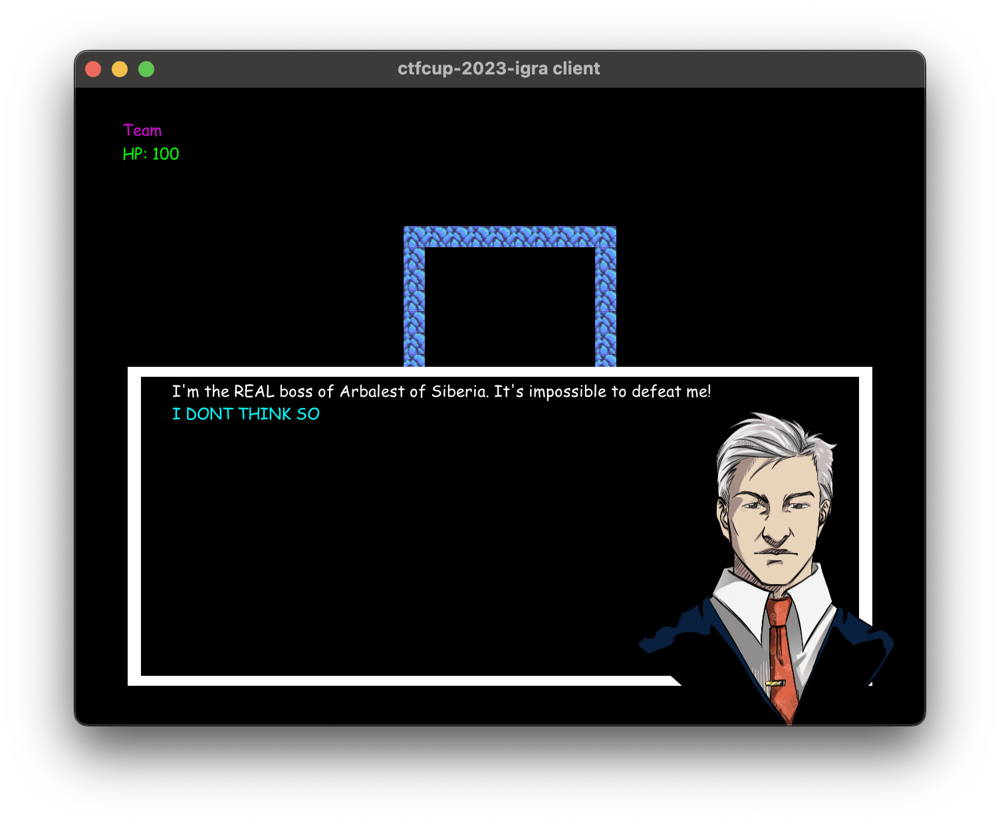

# ctfcup-2023-igra

This is a repository that has a CTF game for the [CTFCUP 2023](https://ctfcup.ru/) finals.

Game consists of 3 levels. There are four items on every level the player can collect.
Participants were given a source code of the game & level and the link to the game server.
The challenge was to collect as many items as possible on the level. To do so, participants may want to write cheats, exploit the game engine bugs and so on.
Game format is inspired by [Google's hackceler8](https://capturetheflag.withgoogle.com/hackceler8).

## How to run

### Standalone

If you want to just play the game locally, run 

```bash
go run cmd/client/main.go -a -l level-1
```

### With server
If you want to have the competition experience, you will need to run the server and the client.

Run the server with
```bash
AUTH_TOKEN=TestTeam:test go run cmd/server/main.go -l level-1 -s ":8085"
```

After you can run the client with
```bash
AUTH_TOKEN=TestTeam:test go run cmd/client/main.go -s "localhost:8085" -l level-1
```

## Screenshots

### Level 1


### Level 2


### Level 3




## Credits

- [Ilya Grekov](https://github.com/b1r1b1r1): Game development, level-design, crypto task development.
- [Ivan Novikov](https://github.com/jnovikov): Game development, level-design.
- [Roman Nikitin](https://github.com/pomo-mondreganto)]: Game development, LLM task&infrastructure development.
- [Nikita Pokrovsky](https://github.com/falamous): Task development (wise-tree).
- [Galilea Anri](https://vk.com/mangalileathecreativesquad): Artwork.

Beta testers:
- [@someone12469](https://github.com/someone12469)
- [@qumusabel](https://github.com/qumusabel)
- [@user39043346](https://github.com/user39043346)
